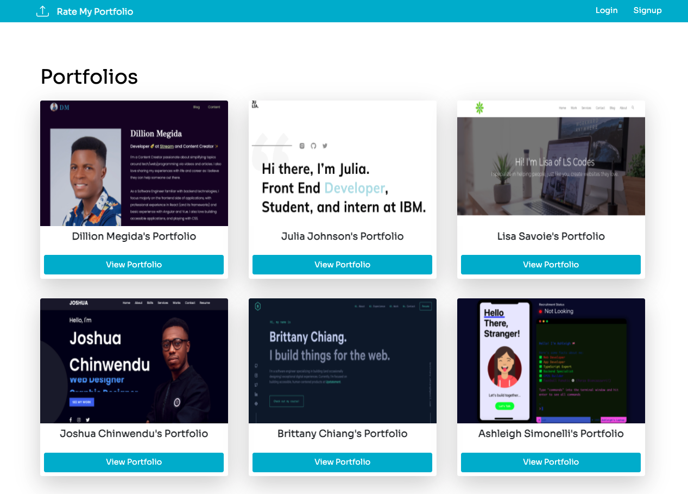

# Rate-My-Portfolio
## Description
This app allows the user to view, give feedback and rate other developer’s portfolios. When the user is on the application’s home page, he/she can see a preview of other developer’s portfolios, but in order add a portfolio, to rate or give feedback he/she need to sign up and create an account.
Technologies such as Tailwind, React.js, Node.js, Express.js, MongoDb, JWT and GraphQl were used in this application


## Table of Contents
* [Installation](#Installation)
* [License](#License)
* [Questions](#Questions)
## Installation
Clone the rate-my-portfolio repository to your local computer. Run ```npm install```, ```npm run install```, ```npm run seed``` and ```npm run develop``` in the command line (Win) or terminal (Mac) to install the dependencies and run the application.


 
## License
This Application is covered under MITLicense

For more information about the License visit [MIT License Page](https://choosealicense.com/licenses/mit/)
## Contributors

- Parisa Ostovari: [https://github.com/parisa-ostovari](https://github.com/parisa-ostovari)
- Robby Hill: [https://github.com/robbyhill20](https://github.com/robbyhill20)
- Hayley McHugh: [https://github.com/HayleyMcHugh](https://github.com/HayleyMcHugh)
- Tommy La: [https://github.com/latommyla](https://github.com/latommyla)
- Hekmatullah Salehi: [https://github.com/hekmatsalehi](https://github.com/hekmatsalehi)
